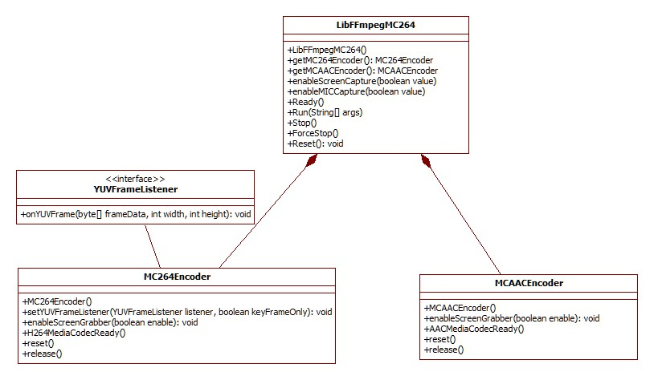

FFmpegMC264Demo
===============

Use 'mc264','mcaac' instead of 'libx264','aac'.

FFmpegMC264 is a ffmpeg android library powered by MediaCodec HW accelated encoder.  
Now use 'mc264', 'mcaac' instead of 'libx264','aac' in runing ffmpeg command in your code.

FFmpegMC264 library doesn't call ffmpeg executable file through exec().
Instead this library has embedded the ffmpeg as an API function.
So, you can call the ffmpeg like this : 
* int retcode = mLibFFmpegMC264.Run(cmdString);
  - cmdString example : 
  - ffmpeg -i INPUT -vcodec mc264 -ac 2 -acodec mcaac -f mp4 OUTPUT
  - ffmpeg -i INPUT -vcodec mc264 -b:v 4.0M -ac 2 -acodec mcaac -b:a 128k -f mp4 OUTPUT
  - ffmpeg -i INPUT -vcodec mc264 -b:v 4.0M -r 30 -g 15 -ac 2 -acodec ac3 -f mp4 OUTPUT
  - ffmpeg -i INPUT -vcodec mc264 -b:v 4.0M -r 30 -g 15 -ac 2 -acodec aac -b:a 64k -f mp4 OUTPUT
  - - aac : '-b:a 64k' recommended or AV sync problem on my device (LG Q6).
  - UDP Streaming : 
  - - ffmpeg -re -i /sdcard/movie.avi -vcodec mc264 -b:v 4.0M -ac 2 -acodec mcaac -b:a 128k -f mpegts udp://192.168.0.12:5555?pkt_size=1316
  - - ffmpeg -re -i /sdcard/movie.avi -vcodec mc264 -b:v 4.0M -ac 2 -acodec mcaac -b:a 128k -max_muxing_queue_size 400 -f mpegts udp://192.168.0.12:5555?pkt_size=1316&buffer_size=655360
  - - - -max_muxing_queue_size 400 : to avoid muxer queue overflow
  - - ffmpeg -i rtsp://192.168.0.10/videodevice -vcodec mc264 -an -f mpegts udp://192.168.0.12:5555?pkt_size=1316
  - - ffmpeg -probesize 0.3M -fflags nobuffer -use_wallclock_as_timestamps 1 -i rtsp://192.168.0.10/videodevice+audiodevice -vcodec mc264 -an -f mpegts udp://192.168.0.12:5555?pkt_size=1316
  - - - -fflags nobuffer -use_wallclock_as_timestamps 1 : to solve AV sync problem
  - RTP Streaming : 
  - - ffmpeg -re -i /sdcard/movie.avi -vcodec mc264 -b:v 4M -ac 2 -acodec mcaac -b:a 128k -f rtp_mpegts rtp://192.168.0.12:5555

  - generate TV test pattern : 
  - ffmpeg -f lavfi -i testsrc -pix_fmt yuv420p -vcodec mc264 -b:v 2.0M -r 30 -g 15 -an -f mp4 OUTPUT
  
For this, in C side, two encoder modules - mc264.c / mcaac.c - have been added into ffmpeg libavcodec. 
In java side, two encoder controller classes - MC264Encoder.java / MCAACEncoder.java - have been added over android MediaCodec (H.264 / AAC encoders only).

Enjoy ffmpeg powered by MediaCodec HW accelated encoder.

## The APIs you have to know : 

### prepare an instance
* mLibFFmpegMC264 = new LibFFmpegMC264();
* mLibFFmpegMC264.getMC264Encoder().setYUVFrameListener(this, true);  - optional API

### prepare an AsyncTask
* ffmpeg_task = new MyTask(this);
* ffmpeg_task.execute( ffmpegCmdStringArray );

### run the instance in the task :: doInBackground()
* mLibFFmpegMC264.Ready();
* mLibFFmpegMC264.Run( strings );

### stop
* mLibFFmpegMC264.Stop();
* mLibFFmpegMC264.ForceStop(); - optional API to enforce stop

### post stop
* mLibFFmpegMC264.Reset();

## Supported Color Format of MC264 Video Encoder :
* YUV format from ffmpeg core to mc264 encoder module should be : yuv420p
* YUV format from mc264 encoder module to Android MediaCodec can be : 
  

   NV12 (MediaCodecInfo.CodecCapabilities.COLOR_FormatYUV420SemiPlanar   
     ==> YUV420 semi planar : [Y1Y2......][Cb1Cr1Cb2Cr2......])  
   YV12 (MediaCodecInfo.CodecCapabilities.COLOR_FormatYUV420Planar  
     ==> YUV420 planar      : [Y1Y2......][Cb1Cb2......][Cr1Cr2.......])   
  

The INPUT stream should have the color format YUV420Planar. Or use '-pix_fmt yuv420p' option with INPUT. 
The MediaCodec of your device should have the color format of NV12 or YV12.

## Limitations :
* It is recommended to use with SD or HD videos. (YUV data copy between Java and JNI is too heavy with Full-HD videos)

## Screenshot

  

* App on google play : https://play.google.com/store/apps/details?id=com.iocaster.ffmpegmc264demoapp

* Other Demo (Android Screen Cast Demo with this library to a network device like PC / SmartTV or a media server over RTP, RTMP, UDP, ...) : 
  https://github.com/iocaster/ScreenCastDemoApp

## Calss Diagram

  

 
 

## Referenced Links :
* MediaCodec example :
  - https://android.googlesource.com/platform/cts/+/jb-mr2-release/tests/tests/media/src/android/media/cts/EncodeDecodeTest.java
* Handling H.264 SPS / PPS :
  - https://github.com/Kickflip/kickflip-android-sdk/blob/master/sdk/src/main/java/io/kickflip/sdk/av/FFmpegMuxer.java
* https://stackoverflow.com/questions/24884827/possible-locations-for-sequence-picture-parameter-sets-for-h-264-stream/24890903#24890903
* https://stackoverflow.com/questions/20909252/calculate-pts-before-frame-encoding-in-ffmpeg
* http://leo.ugr.es/elvira/devel/Tutorial/Java/native1.1/implementing/index.html
* Color Format :
  - https://software.intel.com/en-us/ipp-dev-reference-pixel-and-planar-image-formats#FIG6-15
  - https://developer.android.com/reference/android/graphics/ImageFormat.html#YV12
  - https://en.wikipedia.org/wiki/YUV
* VideoKit :
  - https://github.com/inFullMobile/videokit-ffmpeg-android
  - https://github.com/IljaKosynkin/FFmpeg-Development-Kit
* Cross Compiling FFmpeg 4.0 for Android :
  - https://medium.com/@karthikcodes1999/cross-compiling-ffmpeg-4-0-for-android-b988326f16f2

